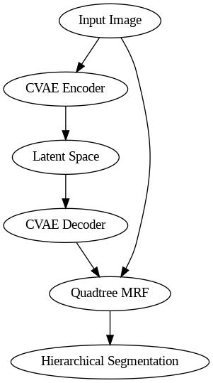

# Semi-Supervised Hierarchical PGM with Contrastive Learning

This repository implements a novel semi-supervised framework that combines contrastive learning with a hierarchical probabilistic graphical model (PGM) for semantic segmentation of remote sensing images. The approach integrates a contrastive variational autoencoder (CVAE) with a quadtree-based Markov random field (MRF) to achieve robust generalization with minimal labeled data.



## Key Features

- **Contrastive Variational Autoencoder (CVAE)**: Learns discriminative latent representations from unlabeled imagery
- **Quadtree-based Markov Random Field**: Captures spatial dependencies at multiple resolutions
- **Hierarchical Belief Propagation**: Refines segmentation through multi-level message passing
- **Semi-Supervised Learning Approach**: Effectively utilizes both labeled and unlabeled data

## Repository Structure

```
cvae-quadratreeMRF/
├── dataset/ - Data loaders and preprocessing
│   └── dataset.py - ISPRS dataset implementation
├── docs/ - Documentation and research materials
│   └── research_proposal.pdf - Project research proposal
├── input/ - Input data directory
├── net/ - Neural network models
│   ├── cvae.py - Contrastive Variational Autoencoder implementation
│   ├── loss.py - Custom loss functions for semi-supervised learning
│   ├── net.py - Hierarchical PGM with integrated components
│   └── quadtree_mrf.py - Quadtree MRF implementation
├── output/ - Results and model checkpoints
├── utils/ - Utility functions
│   ├── export_result.py - Result export and visualization
│   ├── losses.py - Additional loss function implementations
│   ├── utils.py - General utility functions
│   ├── utils_dataset.py - Dataset-specific utilities
│   └── utils_network.py - Network-specific utilities
├── main.py - Training and testing entry point
├── requirements.txt - Project dependencies
└── README.md - Project documentation
```

## Installation

The code was developed and tested with Python 3.9.

### Clone the Repository

```bash
git clone https://github.com/realjules/cvae-quadratreeMRF.git
cd cvae-quadratreeMRF
```

### Install Dependencies

```bash
pip install -r requirements.txt
```

## Dataset

This implementation uses the [ISPRS Vaihingen and Potsdam datasets](http://www2.isprs.org/commissions/comm3/wg4/2d-sem-label-vaihingen.html), which consist of very high-resolution aerial imagery with pixel-wise semantic labels. The datasets can be downloaded from [Kaggle](https://www.kaggle.com/datasets/bkfateam/potsdamvaihingen).

Expected data structure:

```
input/
├── top/ - Input images
│   └── top_mosaic_09cm_area{}.tif
├── gt/ - Ground truth labels
│   └── top_mosaic_09cm_area{}.tif
└── gt_eroded/ - Eroded ground truth (for boundary-aware training)
    └── top_mosaic_09cm_area{}_noBoundary.tif
```

## Usage

### Training

The model can be trained in three modes:
- Full semi-supervised learning (both labeled and unlabeled data)
- Supervised learning only (minimal labeled data)
- Unsupervised learning only (contrastive CVAE)

To train the model with sparse ground truth:

```bash
python main.py -r -g conncomp
```

### Inference

To run inference on test data:

```bash
python main.py -g full
```

### Configuration Options

- `-r, --retrain`: Retrain the model (omit to use a pre-trained model)
- `-g, --gt_type`: Ground truth type (`conncomp` for connected components, `full` for full labels, `ero` for eroded labels)
- `-w, --window`: Window size for training patches (default: 256x256)
- `-b, --batch_size`: Batch size (default: 10)
- `-d, --ero_disk`: Disk size for morphological operations (default: 8)
- `-exp, --experiment_name`: Name for the experiment
- `-lr, --base_lr`: Base learning rate (default: 0.01)
- `-e, --epochs`: Number of training epochs (default: 30)

## Model Architecture

### Contrastive Variational Autoencoder (CVAE)

The CVAE learns discriminative latent representations from unlabeled data. It consists of:
- An encoder that maps input images to a latent space
- A decoder that reconstructs images from latent representations
- A projection head for contrastive learning
- Loss functions for reconstruction, KL divergence, and contrastive learning

### Quadtree MRF

The Quadtree MRF captures spatial dependencies at multiple resolutions by:
- Building a hierarchical quadtree structure of the image
- Implementing belief propagation for label inference
- Capturing pairwise and higher-order relationships between regions
- Integrating with the CVAE latent features

### Hierarchical PGM

The complete model integrates the CVAE and Quadtree MRF, with:
- A shared encoder for feature extraction
- Multi-scale feature fusion
- Hierarchical segmentation heads at different resolutions
- Belief propagation for label refinement

## Results

The model achieves superior performance compared to conventional semi-supervised methods, especially with limited labeled data. Results are evaluated on the ISPRS Vaihingen and Potsdam benchmarks, using metrics such as:
- Overall accuracy
- F1 score per class
- Mean Intersection over Union (mIoU)

## Citation

If you use this code in your research, please cite our paper:

```
@article{niyitegeka2023semisupervised,
  title={Semi-Supervised Hierarchical PGM with Contrastive Learning},
  author={Niyitegeka, Leonard and Udahemuka, Jules},
  journal={},
  year={2023},
  publisher={}
}
```